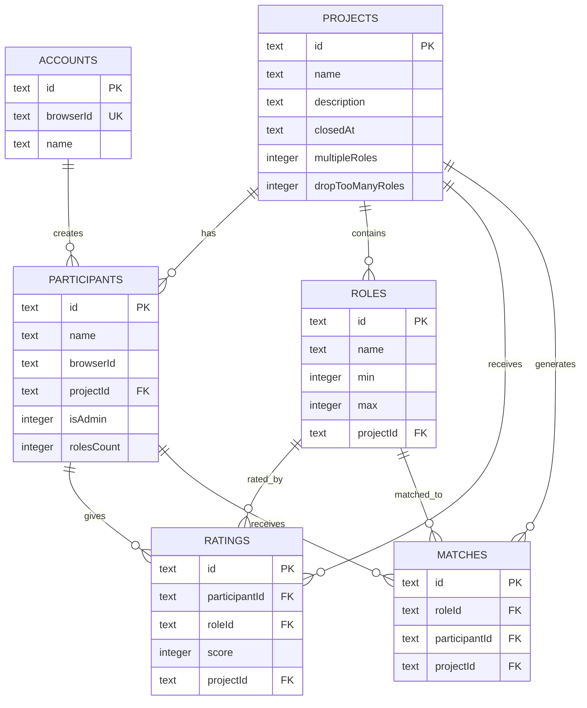

# ER Diagram for How-Match Project

## Entity Relationship Diagram

```mermaid
erDiagram
    ACCOUNTS {
        text id PK
        text browserId UK
        text name
    }

    PROJECTS {
        text id PK
        text name
        text description
        text closedAt
        integer multipleRoles
        integer dropTooManyRoles
    }

    PARTICIPANTS {
        text id PK
        text name
        text browserId
        text projectId FK
        integer isAdmin
        integer rolesCount
    }

    ROLES {
        text id PK
        text name
        integer min
        integer max
        text projectId FK
    }

    RATINGS {
        text id PK
        text participantId FK
        text roleId FK
        integer score
        text projectId FK
    }

    MATCHES {
        text id PK
        text roleId FK
        text participantId FK
        text projectId FK
    }

    %% Relationships
    PROJECTS ||--o{ PARTICIPANTS : "has"
    PROJECTS ||--o{ ROLES : "contains"
    PROJECTS ||--o{ RATINGS : "receives"
    PROJECTS ||--o{ MATCHES : "generates"

    PARTICIPANTS ||--o{ RATINGS : "gives"
    PARTICIPANTS ||--o{ MATCHES : "receives"

    ROLES ||--o{ RATINGS : "rated_by"
    ROLES ||--o{ MATCHES : "matched_to"

    ACCOUNTS ||--o{ PARTICIPANTS : "creates"
```
